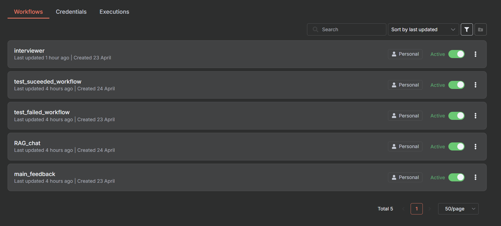

# n8n Workflow Implementation

n8n serves as the backbone of THA Augsburg's automation system, orchestrating the interaction between the frontend, AI agents, and data storage systems.

## Workflow Overview

The diagram above shows our main n8n workflows:
- Test workflow with Pinecone Vector Store integration
- AI Agent workflow with OpenAI integration and Vector Store Tool
- Webhook handling and response generation

## Core Workflows

### 1. Code Submission Workflow

#### Trigger
- Webhook from frontend
- Code submission event

#### Process
1. Validate submission format
2. Route to appropriate AI agents
3. Collect and process responses
4. Generate feedback
5. Update student profile

#### Error Handling
- Invalid submission format
- AI service unavailability
- Timeout handling
- Retry mechanisms

### 2. Learning Progress Workflow

#### Trigger
- Scheduled execution
- Significant progress events

#### Process
1. Collect recent activity data
2. Analyze progress patterns
3. Update learning path
4. Generate progress report
5. Notify relevant parties

#### Analytics
- Success rate tracking
- Time spent analysis
- Error pattern recognition
- Difficulty level assessment

### 3. Context Management Workflow

#### Trigger
- New learning session
- Context update events

#### Process
1. Initialize session context
2. Load relevant history
3. Update knowledge base
4. Prepare resources
5. Maintain session state

#### State Management
- Session persistence
- Context window management
- Resource tracking
- State synchronization

## Integration Points

### Frontend Integration
- REST API endpoints
- WebSocket connections
- Webhook receivers
- Event emitters

### AI Agent Integration
- Agent activation triggers
- Response collection
- Error handling
- State management

### Data Storage Integration
- Database operations
- Cache management
- File storage
- Analytics storage

## Workflow Optimization

### Performance
- Parallel processing
- Caching strategies
- Resource optimization
- Load balancing

### Reliability
- Error recovery
- State persistence
- Backup mechanisms
- Monitoring

## Development and Testing

### Workflow Development
- Version control
- Testing environment
- Deployment process
- Rollback procedures

### Testing Strategies
- Unit testing
- Integration testing
- Load testing
- Error scenario testing

## Monitoring and Maintenance

### Health Monitoring
- Workflow execution tracking
- Performance metrics
- Error logging
- Resource usage

### Maintenance Procedures
- Regular updates
- Performance optimization
- Error resolution
- Capacity planning

## Security Considerations

### Authentication
- API key management
- Access control
- Session management
- Audit logging

### Data Protection
- Encryption
- Data sanitization
- Access restrictions
- Compliance measures 